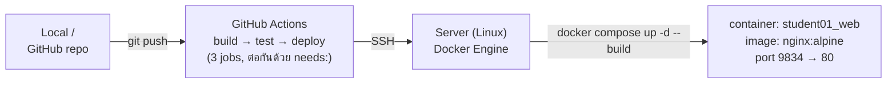

# 1. ภาพรวมสถาปัตยกรรม (Architecture Overview)

อธิบาย flow ทั้งระบบ ตั้งแต่ push โค้ดจนเว็บขึ้นจริงบน server

**อ่าน diagram ทีละลูกศร:**
1. `git push` — คนเขียนโค้ด push ขึ้น branch `main`
2. GitHub Actions ตื่นเอง (trigger จาก push) รัน pipeline 3 job เรียงกัน — [รายละเอียดเต็มที่ 04-cicd-pipeline.md](04-cicd-pipeline.md)
3. Job สุดท้าย (`deploy`) SSH เข้า server จริงด้วย credential ที่เก็บใน GitHub Secrets
4. บน server สั่ง `docker compose up -d --build` — build image ใหม่ + แทนที่ container เก่า
5. Container ใหม่ขึ้นมา ฟัง port 80 ข้างใน map ออกมาที่ port 9834 ของเครื่อง host

**ส่วนประกอบหลักของโปรเจกต์:**

| ไฟล์ | หน้าที่ | อ่านรายละเอียด |
|---|---|---|
| [`index.html`](../index.html) | หน้าเว็บ static (ไม่มี backend) — status dashboard ของวิชา แสดงการ์ด Docker/Compose/CI-CD/Nginx/Registry/Monitoring พร้อม badge Done/Active/Planned | — |
| [`Dockerfile`](../Dockerfile) | สร้าง image: เอา nginx + copy ไฟล์ static เข้าไป | [02-dockerfile.md](02-dockerfile.md) |
| [`docker-compose.yml`](../docker-compose.yml) | สั่งรัน container, ตั้ง port, network, restart policy | [03-docker-compose.md](03-docker-compose.md) |
| [`.github/workflows/deploy.yml`](../.github/workflows/deploy.yml) | Pipeline: build → validate HTML → SSH deploy | [04-cicd-pipeline.md](04-cicd-pipeline.md) |

**⚠️ badge ใน index.html เป็น static text ไม่ sync กับ repo จริง** — ตอนนี้การ์ด "CI/CD Pipeline" ยังโชว์ badge **Planned** ทั้ง item เป็น **todo** หมด ทั้งที่ pipeline 3-job (`build`/`test`/`deploy`) ทำงานจริงแล้ว — อย่าเชื่อ badge บนหน้าเว็บว่าตรงกับสถานะจริงของ repo ต้องเช็คจาก [`.github/workflows/deploy.yml`](../.github/workflows/deploy.yml) เอง

---
[← กลับ README](../README.md) | [ถัดไป: Dockerfile →](02-dockerfile.md)
