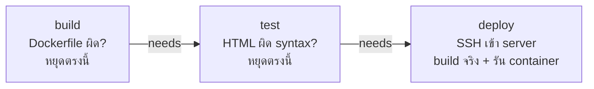

# 4. GitHub Actions Pipeline — ทำงานยังไง

ไฟล์: [`.github/workflows/deploy.yml`](../.github/workflows/deploy.yml)

Trigger: ทุกครั้งที่ `git push` เข้า branch `main`

Pipeline แยกเป็น **3 jobs อิสระ** ต่อกันด้วย `needs:` — แต่ละ job รันบน runner (VM) คนละตัว ล้วนๆ ไม่แชร์ filesystem กัน ดังนั้นทุก job ต้อง `actions/checkout@v4` ของตัวเอง:



**ทำไมต้องแยก 3 job แทนที่จะรวมเป็นก้อนเดียว:** ถ้า job ไหน fail — job ถัดไปที่ `needs:` มันจะ**ไม่รันเลย** เช่น Dockerfile เขียนผิดจนสร้าง image ไม่ได้ → `test` และ `deploy` จะไม่ทำงาน ไม่เสียเวลา SSH เข้า server ไปเจอ error ทีหลัง (fail fast)

*หมายเหตุ: `test` ไม่ได้พึ่ง output ของ `build` จริงๆ (validate HTML ไม่เกี่ยว Docker image) — รันขนานกันได้ถ้าอยากให้ pipeline เร็วขึ้น แต่ lab นี้ตั้งใจรัน sequential ตามลำดับ build > test > deploy เพื่อความชัดเจนตอนสอน*

### Job 1 — `build`
```bash
docker build -t app-web:${{ github.sha }} .
```
Build image จาก [`Dockerfile`](../Dockerfile) บน GitHub runner เพื่อยืนยันว่า Dockerfile ถูกต้อง สร้าง image ได้จริง ก่อนจะไปแตะ server เลย — **ไม่ได้ push image ไปไหน** แค่ validate เท่านั้น (image ที่รันจริงบน server จะถูก build ซ้ำอีกทีใน job `deploy`)

### Job 2 — `test` (validate HTML)
```bash
sudo apt-get update && sudo apt-get install -y tidy
tidy -q -e index.html; [ $? -le 1 ]
```
รัน `tidy` เช็ค syntax ของ `index.html` — ยอมให้ผ่านถ้า exit code ≤ 1 (warning ผ่านได้ แต่ error จริงจะ fail) รันหลังจาก `build` ผ่านแล้วเท่านั้น (`needs: build`)

### Job 3 — `deploy` (SSH เข้า server)
ใช้ action `appleboy/ssh-action` SSH เข้า server ด้วย credential ใน **GitHub Secrets** — รันหลังจาก `test` ผ่านแล้วเท่านั้น (`needs: test`):

| Secret | ใช้ทำอะไร |
|---|---|
| `SERVER_IP` | IP server ปลายทาง |
| `SERVER_USER` | username SSH |
| `SERVER_PASSWORD` | password SSH |

บน server มันรันสคริปต์นี้ (ของจริงจาก [`deploy.yml`](../.github/workflows/deploy.yml)):
```bash
if [ -d ~/app/.git ]; then
  git -C ~/app remote set-url origin https://x-access-token:${{ github.token }}@github.com/${{ github.repository }}.git
  git -C ~/app pull
  git -C ~/app remote set-url origin https://github.com/${{ github.repository }}.git
else
  git clone https://x-access-token:${{ github.token }}@github.com/${{ github.repository }}.git ~/app
  git -C ~/app remote set-url origin https://github.com/${{ github.repository }}.git
fi
cd ~/app
docker compose up -d --build
```

`docker compose up -d --build` = build image ใหม่ + รัน container แบบ background (`-d`) แทนที่ตัวเก่า

⚠️ **มี downtime สั้นๆ ทุกครั้งที่ deploy** — container เก่าถูก stop ก่อน container ใหม่จะพร้อม (ไม่ใช่ zero-downtime deploy) สำหรับ lab นี้ไม่กระทบอะไร แต่เป็น concept ที่ต้องรู้ก่อนเอาไปใช้ production จริง

**จุดสำคัญด้าน security — ทำไมต้อง `remote set-url` สองรอบ:**

`${{ github.token }}` คือ token ชั่วคราวที่ GitHub Actions ออกให้เอง อายุสั้น (หมดอายุเมื่อ job จบ) สคริปต์ทำ:
1. **ใส่ token เข้า remote URL ชั่วคราว** → ใช้ pull/clone โดยไม่ต้องตั้ง `SERVER_PASSWORD` เป็น git credential ถาวร
2. **`pull` เสร็จปุ๊บ → เซต URL กลับเป็นไม่มี token ทันที** → ป้องกัน token ค้างอยู่ใน `~/app/.git/config` บน server (ถ้าใครมาอ่านไฟล์ config ทีหลังจะไม่เจอ credential หลุด)

นี่คือ pattern ที่ถูกต้องสำหรับ CI/CD: ใช้ credential ที่ **อายุสั้นที่สุดเท่าที่จำเป็น** แล้วเช็ดทิ้งทันทีหลังใช้งาน — ไม่ใช่ฝัง token ถาวรไว้บน disk ของ server ปลายทาง

---
[← docker-compose.yml](03-docker-compose.md) | [กลับ README](../README.md) | [ถัดไป: Setup Guide →](05-setup-guide.md)
